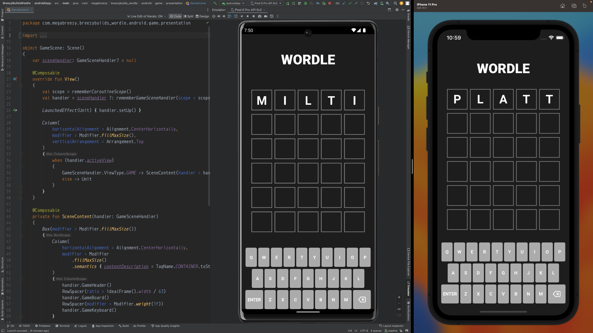

# BreezyBuilds: Wordle

Welcome! What you're looking at is a clone of the classic "Wordle", built from the ground up for mobile devices. 
The aim for this project is primarily to serve as inspiration and reference for game developers wishing to learn [Kotlin Multiplatform](https://kotlinlang.org/docs/multiplatform.html).

## Completed Features:

### Game

* [Clean Architecture Design Doc](https://www.figma.com/file/MGS6fPuVWmYU5GG0uXIOFH/KMM-by-Example%3A-Wordle-(Clean-Architecture)?node-id=107-1879&t=W1HDPcoXkeuzVBys-4)
* [Shared Code](https://github.com/breezybuildsagame/breezybuilds-wordle/tree/main/shared/src/commonMain/kotlin/com/megabreezy/breezybuilds_wordle/feature/game)
* [Shared Unit Tests](https://github.com/breezybuildsagame/breezybuilds-wordle/tree/main/shared/src/commonTest/kotlin/com/megabreezy/breezybuilds_wordle/feature/game)
* [iOS Code](https://github.com/breezybuildsagame/breezybuilds-wordle/tree/main/iosApp/iosApp/feature_game/presentation)
* [iOS Unit Tests](https://github.com/breezybuildsagame/breezybuilds-wordle/tree/main/iosApp/iosAppTests/feature_game/presentation)
* [Android Code](https://github.com/breezybuildsagame/breezybuilds-wordle/tree/main/androidApp/src/main/java/com/megabreezy/breezybuilds_wordle/android/game)
* [Android Unit Tests](https://github.com/breezybuildsagame/breezybuilds-wordle/tree/main/androidApp/src/androidTest/java/com/megabreezy/breezybuilds_wordle/game/presentation)

### Stats

The Stats feature will presents player statistics at the touch of a button and will also serve as a prompt for starting a new game (as the one game per day stipulation is not currently in place).

* [Visual Design Doc](https://www.figma.com/file/zQEo2VR54levonpi5pTd1v/Wordle?node-id=18%3A366&t=J7s3sjvHTIxL951t-1)
* [Clean Architecture Design Doc](https://www.figma.com/file/MGS6fPuVWmYU5GG0uXIOFH/KMM-by-Example%3A-Wordle-(Clean-Architecture)?node-id=509-2813&t=YkGn25ZxF1OavK9V-4)
* [Shared Code](https://github.com/breezybuildsagame/breezybuilds-wordle/tree/main/shared/src/commonMain/kotlin/com/megabreezy/breezybuilds_wordle/feature/stats)
* [Shared Unit Tests](https://github.com/breezybuildsagame/breezybuilds-wordle/tree/main/shared/src/commonTest/kotlin/com/megabreezy/breezybuilds_wordle/feature/stats)
* [iOS Code](https://github.com/breezybuildsagame/breezybuilds-wordle/tree/main/iosApp/iosApp/feature_stats)
* [iOS Unit Tests](https://github.com/breezybuildsagame/breezybuilds-wordle/tree/main/iosApp/iosAppTests/feature_stats)
* [Android Code](https://github.com/breezybuildsagame/breezybuilds-wordle/tree/main/androidApp/src/main/java/com/megabreezy/breezybuilds_wordle/android/stats)
* [Android Unit Tests](https://github.com/breezybuildsagame/breezybuilds-wordle/tree/main/androidApp/src/androidTest/java/com/megabreezy/breezybuilds_wordle/stats)
