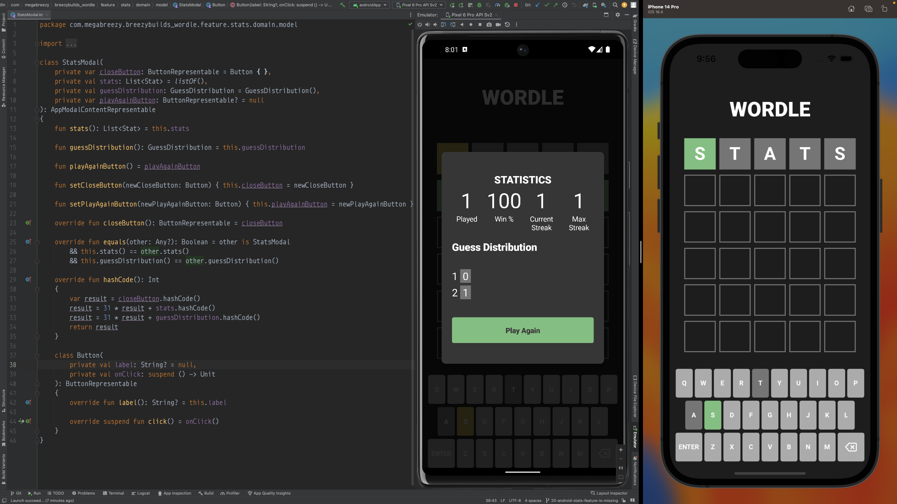
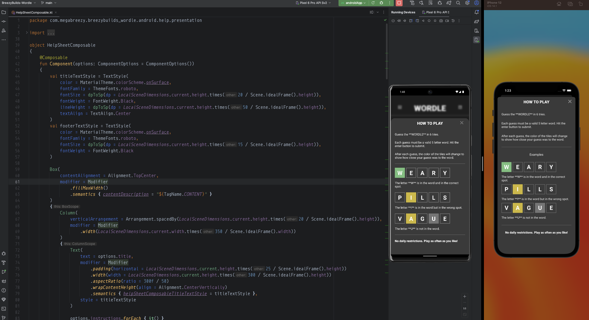

# BreezyBuilds: Wordle

Welcome! What you're looking at is a clone of the classic "Wordle", built from the ground up for mobile devices. 
The aim for this project is primarily to serve as inspiration and reference for game developers wishing to learn [Kotlin Multiplatform](https://kotlinlang.org/docs/multiplatform.html).

## Completed Features:

### Game

The Game feature establishes the core game loop by presenting the player with a Game Board and accepting Keyboard input in order to facilitate gameplay.

* [Clean Architecture Design Doc](https://www.figma.com/file/MGS6fPuVWmYU5GG0uXIOFH/KMM-by-Example%3A-Wordle-(Clean-Architecture)?node-id=107-1879&t=W1HDPcoXkeuzVBys-4)
* [Shared Code](https://github.com/breezybuildsagame/breezybuilds-wordle/tree/main/shared/src/commonMain/kotlin/com/megabreezy/breezybuilds_wordle/feature/game)
* [Shared Unit Tests](https://github.com/breezybuildsagame/breezybuilds-wordle/tree/main/shared/src/commonTest/kotlin/com/megabreezy/breezybuilds_wordle/feature/game)
* [iOS Code](https://github.com/breezybuildsagame/breezybuilds-wordle/tree/main/iosApp/iosApp/feature_game/presentation)
* [iOS Unit Tests](https://github.com/breezybuildsagame/breezybuilds-wordle/tree/main/iosApp/iosAppTests/feature_game/presentation)
* [Android Code](https://github.com/breezybuildsagame/breezybuilds-wordle/tree/main/androidApp/src/main/java/com/megabreezy/breezybuilds_wordle/android/game)
* [Android Unit Tests](https://github.com/breezybuildsagame/breezybuilds-wordle/tree/main/androidApp/src/androidTest/java/com/megabreezy/breezybuilds_wordle/game/presentation)

### Stats

The Stats feature presents player statistics at the touch of a button and also serves as a prompt for starting a new game (as the one game per day stipulation is not currently in place).

* [Visual Design Doc](https://www.figma.com/file/zQEo2VR54levonpi5pTd1v/Wordle?node-id=18%3A366&t=J7s3sjvHTIxL951t-1)
* [Clean Architecture Design Doc](https://www.figma.com/file/MGS6fPuVWmYU5GG0uXIOFH/KMM-by-Example%3A-Wordle-(Clean-Architecture)?node-id=509-2813&t=YkGn25ZxF1OavK9V-4)
* [Shared Code](https://github.com/breezybuildsagame/breezybuilds-wordle/tree/main/shared/src/commonMain/kotlin/com/megabreezy/breezybuilds_wordle/feature/stats)
* [Shared Unit Tests](https://github.com/breezybuildsagame/breezybuilds-wordle/tree/main/shared/src/commonTest/kotlin/com/megabreezy/breezybuilds_wordle/feature/stats)
* [iOS Code](https://github.com/breezybuildsagame/breezybuilds-wordle/tree/main/iosApp/iosApp/feature_stats)
* [iOS Unit Tests](https://github.com/breezybuildsagame/breezybuilds-wordle/tree/main/iosApp/iosAppTests/feature_stats)
* [Android Code](https://github.com/breezybuildsagame/breezybuilds-wordle/tree/main/androidApp/src/main/java/com/megabreezy/breezybuilds_wordle/android/stats)
* [Android Unit Tests](https://github.com/breezybuildsagame/breezybuilds-wordle/tree/main/androidApp/src/androidTest/java/com/megabreezy/breezybuilds_wordle/stats)

### Help

The Help feature presents game instructions at the touch of a button

* [Visual Design Doc] (https://www.figma.com/file/zQEo2VR54levonpi5pTd1v/Wordle?node-id=18%3A366&t=J7s3sjvHTIxL951t-1)
* [Clean Architecture Design Doc](https://www.figma.com/file/MGS6fPuVWmYU5GG0uXIOFH/KMM-by-Example%3A-Wordle-(Clean-Architecture)?type=whiteboard&node-id=669-3228&t=17tWkVCF4akQHAUR-0)
* [Shared Code](https://github.com/breezybuildsagame/breezybuilds-wordle/tree/main/shared/src/commonMain/kotlin/com/megabreezy/breezybuilds_wordle/feature/help)
* [Shared Unit Tests](https://github.com/breezybuildsagame/breezybuilds-wordle/tree/main/shared/src/commonTest/kotlin/com/megabreezy/breezybuilds_wordle/feature/help)
* [iOS Code](https://github.com/breezybuildsagame/breezybuilds-wordle/tree/main/iosApp/iosApp/feature_help)
* [iOS Unit Tests](https://github.com/breezybuildsagame/breezybuilds-wordle/tree/main/iosApp/iosAppTests/feature_help)
* [Android Code](https://github.com/breezybuildsagame/breezybuilds-wordle/tree/main/androidApp/src/main/java/com/megabreezy/breezybuilds_wordle/android/help)
* [Android Unit Tests](https://github.com/breezybuildsagame/breezybuilds-wordle/tree/main/androidApp/src/androidTest/java/com/megabreezy/breezybuilds_wordle/help)
